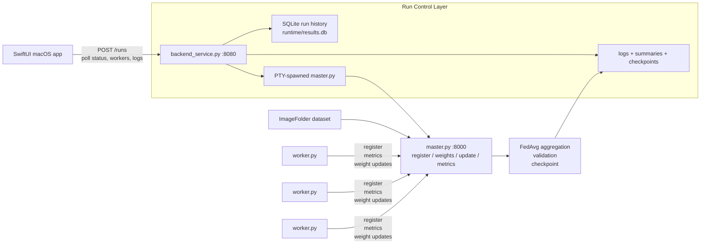
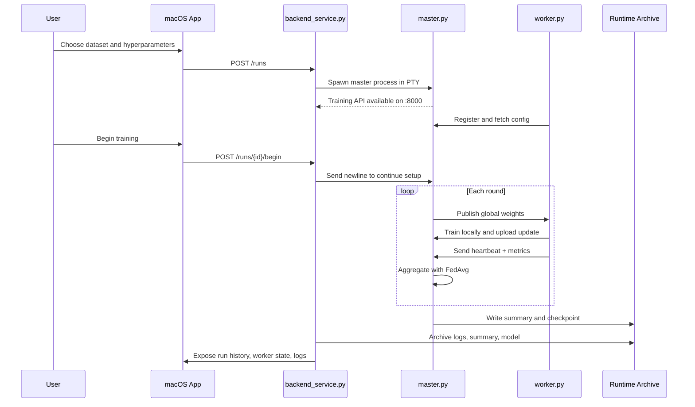

# SharedComputing

SharedComputing is a native macOS control app and Python training stack for turning a few machines on the same network into one practical image-training system.


SharedComputing was built around a simple problem: small ML projects usually hit a wall long before the model is interesting enough to deserve full cloud orchestration. One laptop becomes the bottleneck, the other devices sit idle, and "distributed training" quickly turns into too much setup for too little value.

This project is the middle ground. It keeps the system understandable, local, and hackable while still solving real coordination problems: worker registration, partial failures, dataset sharding, weight aggregation, run history, and device telemetry. The result is a repo that can run the same training problem in three ways: single-machine, local multi-process, or LAN-based master/worker training.

## Repository Snapshot

| Area | What is implemented today |
|------|----------------------------|
| Native client | SwiftUI macOS app for dataset setup, hyperparameters, device connection, and results history |
| Run control | FastAPI wrapper on port `8080`, SQLite run archive, log capture, summary and checkpoint archiving |
| Training engine | `train.py`, `train_dist.py`, `master.py`, and `worker.py` |
| Coordination | Worker registration, FedAvg aggregation, quality/speed modes, heartbeat-aware waiting |
| Telemetry | Local Mac metrics via IOKit and remote worker metrics via `psutil` |
| Sample data | Included `ImageFolder` dataset with 1,803 images across 7 classes |

## Architecture Overview



## Why This Architecture

This repo does not jump straight to a full distributed platform. Instead, it layers complexity in a way that makes the system easier to reason about:

1. `train.py` gives a single-machine baseline.
2. `train_dist.py` proves the same idea locally with multiprocessing and FedAvg.
3. `master.py` and `worker.py` move the same orchestration model onto the LAN.
4. `backend_service.py` wraps that terminal-first flow in an API that a native app can control.

That progression is the real design idea in this project. Each step solves a different coordination problem without hiding the underlying training loop.

## Training Paths

| Entry point | Use case | What it does |
|-------------|----------|--------------|
| `train.py` | Baseline training on one machine | Runs ResNet18 transfer learning locally and writes `summary.md` + `models/best_model.pth` |
| `train_dist.py` | Local multi-process experiment | Spawns worker processes on one machine, averages updates with FedAvg, writes `summary_dist.md` |
| `master.py` + `worker.py` | LAN training across devices | Coordinates remote workers over HTTP, aggregates updates, tracks metrics, writes `summary_net.md` |
| `backend_service.py` | Control plane for UI or scripts | Creates runs, starts/stops training, archives logs and results, exposes run history |

## Training Modes

| Mode | How data is assigned | Why it exists |
|------|----------------------|---------------|
| `quality` | Every worker trains on the full train split | Simple FedAvg behavior with more overlap across workers |
| `speed` | Train indices are divided across workers | Lower per-round work and faster wall-clock progress |

## Run Lifecycle



## Tech Stack

| Layer | Technology | Why it is used |
|------|------------|----------------|
| Native UI | SwiftUI + Observation | Lightweight macOS control surface for setup, monitoring, and results |
| Control API | FastAPI + Uvicorn | Simple orchestration layer around training runs |
| Training | PyTorch + torchvision | Transfer learning, local training, and FedAvg aggregation |
| Worker telemetry | `psutil` | CPU, memory, and temperature reporting from workers |
| Local system metrics | IOKit + Mach APIs | Native CPU, RAM, GPU, and temperature readings on macOS |
| Run archive | SQLite | Persistent local history without extra infrastructure |
| Containerization | Docker + Docker Compose | Reproducible backend wrapper environment |

## Key Design Decisions

| Decision | Why | Alternative |
|----------|-----|-------------|
| Separate control API from training API | Keeps UI orchestration and training logic decoupled | One monolithic process for both concerns |
| PTY-spawned master process | Reuses the terminal-first training flow without rewriting it for the GUI | Rebuild master orchestration as a pure library |
| FedAvg aggregation | Easy to understand and fits both local and LAN-based experiments | Parameter server or synchronous gradient exchange |
| Heartbeat-aware waiting | Avoids throwing away progress when workers are slow but still alive | Fixed timeout with hard failure |
| Quality vs speed mode | Lets users trade statistical overlap for faster rounds | Single rigid scheduling mode |
| SQLite run archive | Gives local observability and history with almost zero ops cost | External database or log service |
| Worker-local datasets | Avoids streaming training data over the network | Central dataset server |

## Current Scope

The strongest end-to-end path in this repository is:

- ResNet18 transfer learning
- LAN-based master/worker training
- `quality` and `speed` scheduling modes
- macOS app to start runs and inspect history
- Local result archiving through SQLite, logs, summaries, and checkpoints

There are also a few edges that are clearly scaffolded for future work:

- Additional backbones are exposed in the broader system design, but ResNet18 is the only model fully implemented end-to-end today.
- Remote worker onboarding is still LAN-first and worker startup is CLI-driven.
- `predict.py` is a lightweight utility and is not yet driven by stored run metadata or dynamic class labels.

## Example Dataset In This Repo

The repository already includes a sample `ImageFolder` dataset under [`data/`](data/):

| Class | Images |
|------|-------:|
| `bike` | 365 |
| `cars` | 420 |
| `cats` | 202 |
| `dogs` | 202 |
| `flowers` | 210 |
| `horses` | 202 |
| `human` | 202 |

Total: **1,803 images**

## Project Structure

```text
SharedComputing/
|-- SharedComputingMac/              # Native macOS SwiftUI app
|-- master.py                        # Network master + training API on :8000
|-- worker.py                        # Remote worker that trains and uploads weights
|-- backend_service.py               # Control API on :8080, run archive, log capture
|-- backend_helpers.py               # Dataset path, image counting, summary parsing helpers
|-- train.py                         # Single-machine baseline
|-- train_dist.py                    # Local multiprocessing FedAvg baseline
|-- predict.py                       # Quick inference utility
|-- run.py                           # Runs single-machine then local distributed flow
|-- tests/
|   `-- test_backend_helpers.py      # Helper tests
|-- data/                            # ImageFolder dataset
|-- docker-compose.yml               # Backend wrapper container setup
|-- Dockerfile                       # Python 3.11 + FastAPI + CPU PyTorch image
`-- runtime/                         # Created at runtime for DB, logs, summaries, models
```

## Getting Started

### Docker

The Docker setup runs the control backend and lets it spawn training runs inside the container. It expects two environment variables:

- `ADVERTISED_HOST`: the LAN IP workers should call back to
- `DATASET_ROOT_HOST`: the dataset directory on the host machine

```bash
export ADVERTISED_HOST=192.168.0.10
export DATASET_ROOT_HOST=$PWD/data
docker compose up --build
```

After startup:

- Control API: `http://localhost:8080`
- Health check: `http://localhost:8080/health`
- Training API: `http://localhost:8000` after a run is created and the master starts

### Local Python Setup

```bash
python3 -m venv .venv
source .venv/bin/activate
pip install -r requirements-backend.txt
pip install --index-url https://download.pytorch.org/whl/cpu \
  --extra-index-url https://pypi.org/simple torch torchvision
pip install psutil

ADVERTISED_HOST=<your-lan-ip> \
DATASET_ROOT=$PWD/data \
python3 backend_service.py
```

Then on the same machine or another machine with the repository and dataset available:

```bash
python3 worker.py
```

`worker.py` will prompt for the master IP and then register with `master.py`.

### Native macOS App

Open the Xcode project and run the app:

```bash
open SharedComputingMac/SharedComputingMac.xcodeproj
```

The app is designed to:

- choose a dataset folder
- set rounds, epochs, batch size, timeout, and mode
- start the backend wrapper
- create and begin runs
- poll run history, worker state, and logs

## Testing

Current automated coverage is focused on the helper layer that the control backend depends on:

- dataset path safety
- image counting
- train/val/test split math
- summary parsing

Run the tests with:

```bash
python3 -m unittest tests.test_backend_helpers -q
```

## Why This Project Is Interesting

SharedComputing is not just "PyTorch over HTTP." The interesting part is how it solves several practical coordination issues without hiding them behind a heavy platform:

- It preserves a clear single-machine baseline before introducing distribution.
- It supports both whole-dataset and sharded worker scheduling.
- It keeps the training loop inspectable while still giving the user a native app.
- It archives enough run state to make repeated experiments comparable.
- It treats observability as part of the workflow, not an afterthought.

That combination makes it a useful engineering project: part ML systems exercise, part orchestration exercise, and part product-design exercise for making distributed training feel approachable.
